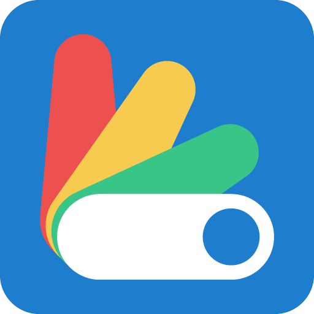

# <br>Color Filter Status App

**Color Filter Status App** is a Windows desktop application developed in .NET Framework 4.8 that monitors and controls the Windows Accessibility "Color filters" setting. The app runs in the system tray and allows you to toggle the color filter on or off, select a specific filter mode, and view the current status with an icon indicator.

## 🛠️ Features

- **System tray application:** Runs entirely in the system tray without displaying a main window.
- **Toggle color filters:** Enable or disable the color filters setting.
- **Select filter mode:** Choose from multiple filter modes (e.g., Grayscale, Inverted, Grayscale Inverted, Deuteranopia, Protanopia, Tritanopia).
- **Real-time updates:** Monitors registry changes and updates the tray icon.

## 🖥️ Requirements

- **Operating System:** Windows 10 or Windows 11
- **.NET Framework 4.8**
- **Visual Studio 2019/2022** (recommended for building the source code)

## 📦 Installation

1. Download the latest release from the [GitHub Releases](https://github.com/vulpeep/color-filter-status-app/releases) page.
2. Run `ColorFilterStatusApp.exe` to launch the application.

## 🖱️ Usage

After launching, the application minimizes to the system tray. Right-click the tray icon to open the context menu.

## 🔨 Building the project

1. **Clone the repository:**

   ```bash
   git clone https://github.com/vulpeep/color-filter-status-app.git
   ```

2. **Open the solution:**

   Open `ColorFilterStatusApp.sln` in Visual Studio 2019/2022.

3. **Build the solution:**

   Build the project in **Release** mode. The built executable will be located in the `bin\Release` folder.


## 📄 License

[MIT](LICENSE)
